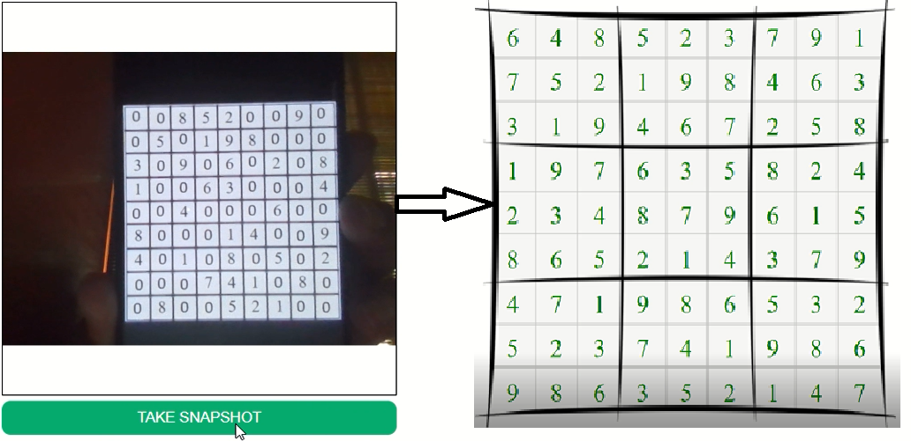

# web-sudoku
A flask webapp to solve sudoku from image input



[Demo link](https://www.linkedin.com/posts/yash-indane-aa6534179_aws-flask-python-activity-6803238011279548416-jjeQ)

## AWS CLI configuration

Have user ready in AWS with admin and power user access. This user will be used to call the AWS Textract service.
Create a S3 bucket in this users account.

# Usage

```
$ sudo docker run -dit -p <PORT-NO>:1453  --name <NAME> yashindane/websudoku:v1 --aak="<AWS_ACCESS_KEY>" --ask="<AWS_SECRET_KEY>" --region="<REGION>" --bucketname="<BUCKET_NAME>"
```

# On arm64 v8 machines

```
$ sudo docker run --platform linux/arm64/v8 -dit -p <PORT-NO>:1453  --name <NAME> yashindane/websudoku:arm64v8 --aak="<AWS_ACCESS_KEY>" --ask="<AWS_SECRET_KEY>" --region="<REGION>" --bucketname="<BUCKET_NAME>"
```

# On arm64 v8 machines using podman

```
$ sudo podman run --platform linux/arm64/v8 -dit -p <PORT-NO>:1453  --name <NAME> docker.io/yashindane/websudoku:arm64v8 --aak="<AWS_ACCESS_KEY>" --ask="<AWS_SECRET_KEY>" --region="<REGION>" --bucketname="<BUCKET_NAME>"
```

## How it works

The user first clicks a pic of there sudoku board and submits it. The `data_uri` of the image goes to backend `app2.py` script through the form on user click.
Using `base64`, `ìo` and `PIL` libraries, the image is saved in the server and then uploaded to `S3` bucket. Now using `AWS Textract`, the digits from the image in bucket are extracted and send back to the `app2.py`. This digits in a double array are fed to the function `sudoku3.solve()`, which returns the solution to the problem. This diits are then rendered on the `output.html` page.

Pull requests and new Ideas are welcome!
